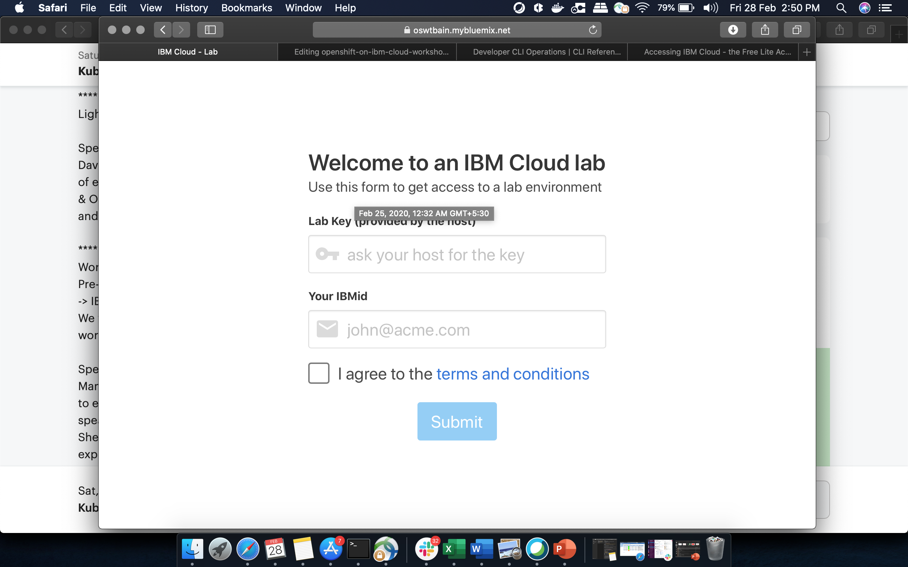
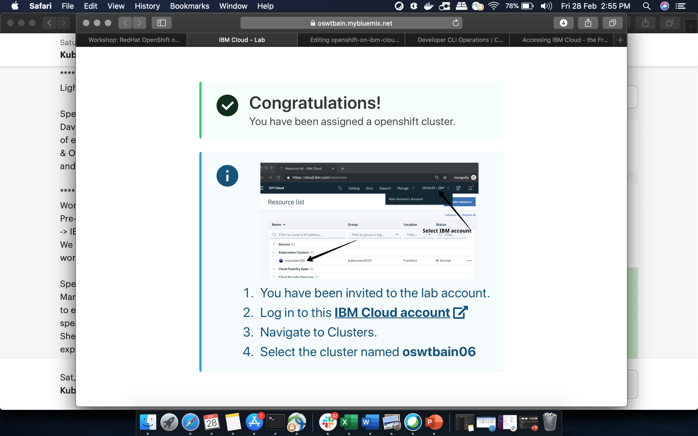
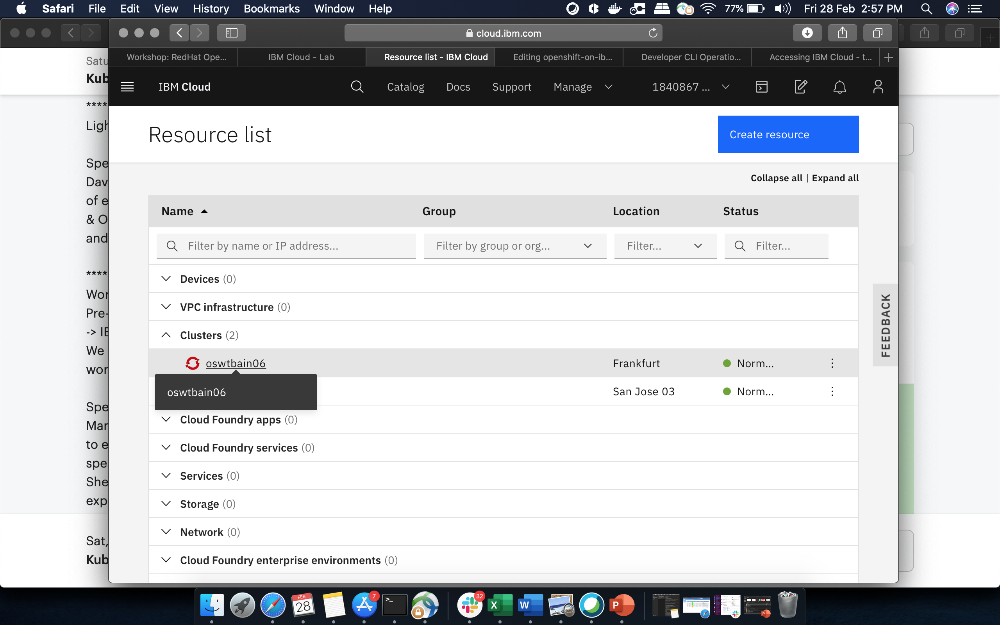
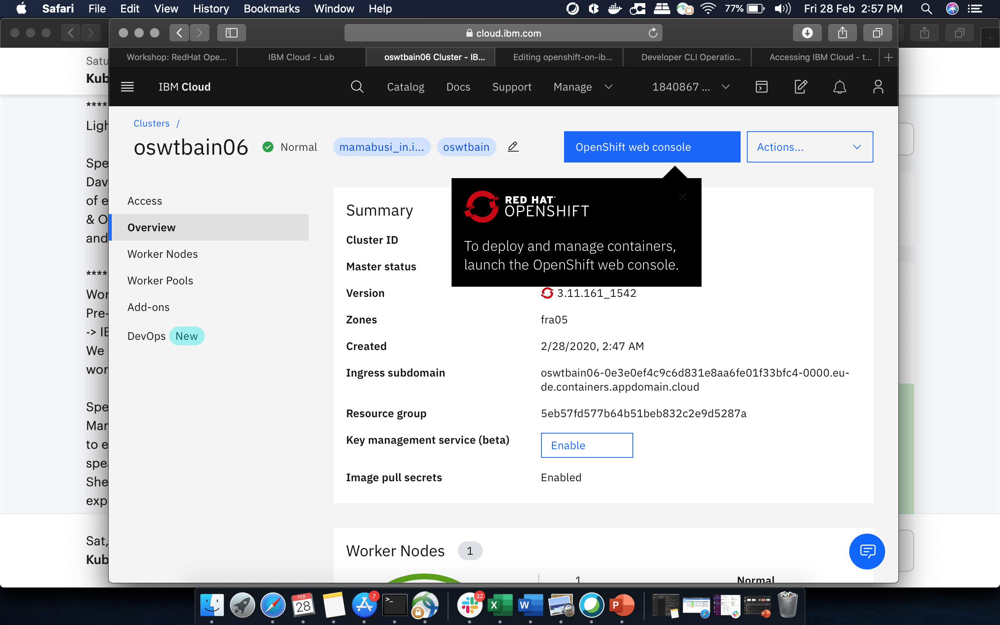

### Access to the IBM Cloud

> Installing prerequisites: [video (2:58 mins)](https://youtu.be/c5CtqijWXL4) and [video including windows (4:11 mins)](https://youtu.be/53XccO3NNn8)

An IBM Cloud account is needed. [Register](http://bit.ly/OSworkshop2) if you do not have one.

### Access to the OpenShift cluster

We will use the Pre-provisioned Openshift cluster on IBM Cloud in this hands-on workshop.

[Login](https://oswtbain.mybluemix.net) with your registered email id used for IBM Cloud account and enter lab key as: **oslab**


  
Login to IBM Cloud and access the cluster


  

  
Click on the cluster: 


Open the **OpenShift web console**


### Get our access token for the 'oc' CLI. 


From the dropdown menu in the upper right of the page, click 'Copy Login Command'. 


### Access the Cloud shell (command prompt)
1. You will need the [Cloud shell](https://shell.cloud.ibm.com/) to connect to the OpenShift cluster via command prompt.

Paste the copied access token command into your terminal.

2. Verify 'oc' CLI

```
$ oc login https://c1-e.us-east.containers.cloud.ibm.com:23967 --token=xxxxxx'
$ oc projects
```

3. Verify 'kubectl' CLI

```
$ kubectl get pods
```
---

Go back to lab 1. Build and Save the container image' in ['Step 1'](./4-openshift.md#step-1-create-an-open-shift-project)

